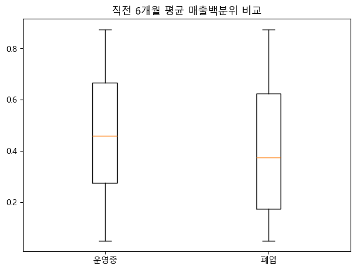

# 최종 보고서

진행 상황: 0%
담당자: 정인 
상태: 진행 중

# 가맹점 폐업 위험 예측 모델 기반 상권 조기경보 및 맞춤형 지원 시스템

> 제 13회 2025 빅콘테스트 “미래를 예측하는 데이터 챌린지”
우리 동네 가맹점, 위기 신호를 미리 잡아라!
> 

# 연구 개요

### 목적

소상공인과 자영업자가 운영하는 가맹점들은 우리 경제의 근간을 이루는 중요한 축입니다. 하지만, 급변하는 환경 속에서 자영업자는 다양한 위기에 노출되기 쉽습니다.

개인의 경험만으로는 감지하기 어려운 위험 신호를 데이터를 활용하여 예측할 수 있는 모델을 제안하고자 합니다.

### 핵심 분석 전략

- **다층적 모델링 :** Cox 생존분석(시간 기반) + 로지스틱(해석) + 랜덤포레스트(예측력)
- **시계열 특징 공학 :** 전월/전년 대비 증감률, 6개월 변동성, 회복지수 등 53개→120개 변수 확장
- **업종별 맞춤화 :** 약 70여개 업종별 위험 패턴 차별화 분석
- **정책 실행 가능성 :** 위험군 자동 분류 및 지원 패키지 자동 매칭 시스템

# EDA

### 파생변수 생성

1. 거래안정성 지표 - ‘고객분포 다양성 지수’ 생성
- 매출 변동성에 대하여 탐색적 분석을 하는 과정 중, 특정 고객층이 집중된다면 하이리스크라는 점을 발견

<aside>
💡

[랜덤 포레스트 결과]

정확도: 0.9486
AUC Score: 0.9828

분류 리포트:
precision    recall   f1-score   support

```
      정상       0.96      0.62      0.76     65839
      위험       0.95      1.00      0.97    449146

accuracy                           0.95    514985

```

macro avg       0.96      0.81      0.86    514985
weighted avg       0.95      0.95      0.94    514985

혼동 행렬:
[[ 40880  24959]
[  1520 447626]]

TN: 40880, FP: 24959
FN: 1520, TP: 447626

[변수 중요도 - Random Forest]
변수      중요도
동일 업종 매출금액 비율 0.786995
고객분포_다양성지수 0.074894
동일 상권 내 매출 순위 비율 0.072422
재방문 고객 비중 0.056653
동일 업종 내 해지 가맹점 비중 0.008661
매출건수_변화율 0.000217
매출금액_변화율 0.000158

[로지스틱 회귀 계수]
변수        계수
고객분포_다양성지수  0.829650
동일 업종 내 해지 가맹점 비중  0.070834
매출금액_변화율  0.008448
매출건수_변화율 -0.027801
재방문 고객 비중 -0.077628
동일 상권 내 매출 순위 비율 -0.328894
동일 업종 매출금액 비율 -0.763066

</aside>

- 결론 : 거래 안정성은 고객 분포 다양성 지수에 큰 영향을 받는 것을 발견함. 고객의 연령층이나 특징이 다양할수록 거래의 안정성이 상승한다고 판단.
- 거래 안정성이 크면 매출 경쟁력이 올라감.
- 재방문 고객, 유니크 고객의 중요성이 크다는 것을 시사함.
- 위 랜덤포레스트 결과를 바탕으로 ‘고객분포 다양성지수’ 컬럼을 생성하였고 유의미한 독립변수를 설정하는데 참고함.

1. 장기하락 추세여부 및 매출관련 지표 도출
- 폐업 가맹점 필터링
- 폐업 가맹점의 매출 관련한 특징을 알아보기 위해 EDA진행 (감소율, 3개월 연속감소, 회복지수)

```jsx
# 구간 문자열 → 순서형 숫자로 맵핑
mapping = {
    '1_상위1구간': 1.0, '2_10-25%': 0.875, '3_25-50%': 0.625, 
    '4_50-75%': 0.375, '5_75-90%': 0.175, '6_90%초과(하위 10% 이하)': 0.05
}
df_merged['매출금액 구간_백분위'] = df_merged['매출금액 구간'].map(mapping)

# 2️⃣ 전월 대비 매출금액 감소율 (%)
df_merged['매출금액 구간_전월증감'] = (
    g['매출금액 구간_백분위'].diff() / g['매출금액 구간_백분위'].shift(1)
) * 100

# 3️⃣ 3개월 연속 감소 여부 (True/False)
df_merged['매출금액 구간_연속감소'] = (
    g['매출금액 구간_백분위']
    .apply(lambda x: x.diff().lt(0).rolling(3).sum() == 3)
)

# 4️⃣ 6개월 회복지수 (최근값이 최소~최대 사이 어느 정도 회복했는가)
def calc_recovery(series):
    roll_min = series.rolling(6, min_periods=3).min()
    roll_max = series.rolling(6, min_periods=3).max()
    denom = (roll_max - roll_min).replace(0, np.nan)
    return (series - roll_min) / denom

df_merged['매출금액 구간_회복지수_6개월'] = g['매출금액 구간_백분위'].apply(calc_recovery)

```




- 폐업된 업체를 위주로 분석한 결과 중요 변수 중 회복지수를 포함하여 유의미하게 나온 변수들을 독립변수로 설정함.

```
=== 📊 매출탄력도 영향 요인 (RandomForest) ===
                   변수       중요도
8    동일 상권 내 매출 순위 비율  0.181097
0            신규 고객 비중  0.176714
7    동일 업종 내 매출 순위 비율  0.169690
6    매출금액 구간_회복지수_6개월  0.167364
4           배달매출금액 비율  0.074097
1           재방문 고객 비중  0.068149
10  동일 상권 내 해지 가맹점 비중  0.045953
9   동일 업종 내 해지 가맹점 비중  0.045731
5         매출건수 구간_백분위  0.033236
2     유니크 고객 수 구간_백분위  0.020450
3          객단가 구간_백분위  0.017519

모델 설명력 R²: 0.897
```

### 변수 선택 및 정제 - 다중공선성 제거

- 분산이 낮은 컬럼 제거

```jsx
low_var_cols = [col for col in numeric_cols if df[col].var() < 1e-5]
if low_var_cols:
    print("분산이 낮은 컬럼 제거:", low_var_cols)
    df = df.drop(columns=low_var_cols)
    numeric_cols = [col for col in numeric_cols if col not in low_var_cols]
```

- 결측, 무한대 처리

```jsx
df = df.replace([np.inf, -np.inf], np.nan)
df = df.dropna(subset=['운영개월', 'event'] + numeric_cols)
```

- VIF로 다중공선성 제거

```jsx
ef calculate_vif(df, cols):
    vif_data = pd.DataFrame()
    vif_data["feature"] = cols
    vif_data["VIF"] = [variance_inflation_factor(df[cols].values, i)
                       for i in range(len(cols))]
    return vif_data

vif_df = calculate_vif(df, numeric_cols)
high_vif_cols = vif_df[vif_df["VIF"] > 10]["feature"].tolist()
if high_vif_cols:
    print("다중공선성 높은 컬럼 제거:", high_vif_cols)
    df = df.drop(columns=high_vif_cols)
    numeric_cols = [col for col in numeric_cols if col not in high_vif_cols]
```

- 결과

분산이 낮은 컬럼 제거: ['3개월 연속 감소 여부']

다중공선성 높은 컬럼 제거: ['동일 업종 내 매출 순위 비율', '동일 상권 내 매출 순위 비율_x', '동일 업종 내 해지 가맹점 비중_x', '남성 20대이하 고객 비중', '남성 30대 고객 비중', '남성 40대 고객 비중', '남성 50대 고객 비중', '남성 60대이상 고객 비중', '여성 20대이하 고객 비중', '여성 30대 고객 비중', '여성 40대 고객 비중', '여성 50대 고객 비중', '여성 60대이상 고객 비중', '재방문 고객 비중_x', '신규 고객 비중', '거주 이용 고객 비율', '직장 이용 고객 비율', '유동인구 이용 고객 비율', '동일 상권 내 매출 순위 비율_y', '동일 업종 내 해지 가맹점 비중_y']

### 최종 데이터

- 위 EDA 결과를 바탕으로 DataFrame을 재구성함.


- 컬럼 리스트
    
    ```
    ['Unnamed: 0',
     '가맹점구분번호',
     '기준년월',
     '가맹점 운영개월수 구간',
     '매출금액 구간',
     '매출건수 구간',
     '유니크 고객 수 구간',
     '객단가 구간',
     '취소율 구간',
     '배달매출금액 비율',
     '동일 업종 매출금액 비율_x',
     '동일 업종 매출건수 비율',
     '동일 업종 내 매출 순위 비율',
     '동일 상권 내 매출 순위 비율_x',
     '동일 업종 내 해지 가맹점 비중_x',
     '동일 상권 내 해지 가맹점 비중',
     '남성 20대이하 고객 비중',
     '남성 30대 고객 비중',
     '남성 40대 고객 비중',
     '남성 50대 고객 비중',
     '남성 60대이상 고객 비중',
     '여성 20대이하 고객 비중',
     '여성 30대 고객 비중',
     '여성 40대 고객 비중',
     '여성 50대 고객 비중',
     '여성 60대이상 고객 비중',
     '재방문 고객 비중_x',
     '신규 고객 비중',
     '거주 이용 고객 비율',
     '직장 이용 고객 비율',
     '유동인구 이용 고객 비율',
     '가맹점주소',
     '가맹점명',
     '브랜드구분코드',
     '가맹점지역',
     '업종',
     '상권',
     '개설일',
     '폐업일',
     '기준년월_최신',
     '전월대비 매출금액 감소율(%)',
     '3개월 연속 감소 여부',
     '6개월 하락추세 여부',
     '매출금액 구간_회복지수_6개월',
     '급감여부(-20% YoY)',
     '매출 안정성(변동성) CV(3개월)',
     '매출탄력도(6개월)',
     '매출 안정성(변동성) 여부',
     '동일 상권 내 매출 순위 비율_y',
     '동일 업종 내 해지 가맹점 비중_y',
     '고객분포_다양성지수',
     '동일 업종 매출금액 비율_y',
     '재방문 고객 비중_y']
    ```
    

# Modeling

> 시계열 (기간별) & 업종별 분석을 중심으로 세부적인 예측이 가능한 모델을 개발을 목표로 함.
> 

## 1. **Cox Proportional Hazards Model** 기반의 가맹점 폐업 시점 예측 (생존 분석)

| **model** | lifelines.CoxPHFitter |
| --- | --- |
| **duration col** | '운영개월' |
| **event col** | 'event' |
| **baseline estimation** | breslow |
| **number of observations** | 27000 |
| **number of events observed** | 843 |
| **partial log-likelihood** | -8425.77 |
| **time fit was run** | 2025-10-21 12:05:10 UTC |

| **coef** | **exp(coef)** | **se(coef)** | **coef lower 95%** | **coef upper 95%** | **exp(coef) lower 95%** | **exp(coef) upper 95%** | **cmp to** | **z** | **p** | **-log2(p)** |
| --- | --- | --- | --- | --- | --- | --- | --- | --- | --- | --- |
| **Unnamed: 0** | 0.00 | 1.00 | 0.00 | -0.00 | 0.00 | 1.00 | 1.00 | 0.00 | 0.56 | 0.58 |
| **배달매출금액 비율** | 0.00 | 1.00 | 0.00 | 0.00 | 0.00 | 1.00 | 1.00 | 0.00 | 9.71 | <0.005 |
| **동일 업종 매출금액 비율_x** | 0.00 | 1.00 | 0.00 | 0.00 | 0.00 | 1.00 | 1.00 | 0.00 | 10.09 | <0.005 |
| **동일 업종 매출건수 비율** | 0.00 | 1.00 | 0.00 | 0.00 | 0.00 | 1.00 | 1.00 | 0.00 | 4.93 | <0.005 |
| **동일 상권 내 해지 가맹점 비중** | -0.00 | 1.00 | 0.00 | -0.00 | -0.00 | 1.00 | 1.00 | 0.00 | -6.32 | <0.005 |
| **전월대비 매출금액 감소율(%)** | 0.00 | 1.00 | 0.00 | -0.00 | 0.00 | 1.00 | 1.00 | 0.00 | 0.66 | 0.51 |
| **6개월 하락추세 여부** | -0.09 | 0.91 | 0.09 | -0.27 | 0.08 | 0.77 | 1.09 | 0.00 | -1.03 | 0.30 |
| **매출금액 구간_회복지수_6개월** | -0.03 | 0.97 | 0.11 | -0.25 | 0.19 | 0.78 | 1.20 | 0.00 | -0.27 | 0.78 |
| **급감여부(-20% YoY)** | 0.37 | 1.45 | 0.08 | 0.21 | 0.54 | 1.23 | 1.71 | 0.00 | 4.40 | <0.005 |
| **매출 안정성(변동성) CV(3개월)** | -0.35 | 0.70 | 0.22 | -0.79 | 0.09 | 0.45 | 1.09 | 0.00 | -1.58 | 0.12 |
| **매출탄력도(6개월)** | -0.01 | 0.99 | 0.00 | -0.02 | 0.00 | 0.98 | 1.00 | 0.00 | -1.42 | 0.15 |
| **매출 안정성(변동성) 여부** | 0.26 | 1.30 | 0.13 | 0.00 | 0.52 | 1.00 | 1.68 | 0.00 | 1.96 | 0.05 |
| **동일 업종 매출금액 비율_y** | -0.01 | 0.99 | 0.00 | -0.01 | -0.00 | 0.99 | 1.00 | 0.00 | -8.64 | <0.005 |
| **재방문 고객 비중_y** | -0.00 | 1.00 | 0.00 | -0.00 | -0.00 | 1.00 | 1.00 | 0.00 | -2.15 | 0.03 |

| **Concordance** | 0.64 |
| --- | --- |
| **Partial AIC** | 16879.54 |
| **log-likelihood ratio test** | 325.15 on 14 df |
| **-log2(p) of ll-ratio test** | 199.92 |

<aside>
💡

모형 Concordance Index: 0.6423

</aside>

### 모형 성능 평가

| **지표** | **값** | **해석** |
| --- | --- | --- |
| **Concordance Index (C-index)** | 0.64 | 모형의 **순위 예측 정확도**. |
| 0.5는 랜덤 수준, 1.0은 완벽 예측 → **꽤 의미 있는 수준 (좋은 예측력)** |  |  |
| **Partial AIC** | 27778 | 낮을수록 좋은 적합도. 다른 모형과 비교용. |
| **log-likelihood ratio test** | p < 0.005 | 전체 모형이 통계적으로 유의함. (변수 전체가 의미 있음) |

### 해석

- Cox 모형은 "시간이 지날수록 폐업할 위험이 얼마나 높은가" 를 예측합니다. 즉, coef가 양수이면 폐업 위험 증가, 음수이면 폐업 위험 감소입니다.

### 변수명 해석 의미 요약

| **변수명** | **영향 방향** | **위험도 (Hazard Ratio)** | **해석** |
| --- | --- | --- | --- |
| **급감여부 (-20% YoY)** | ▲ 증가 | 1.45배 | 전년 대비 20% 이상 급감 시 폐업 위험 45% 증가 |
| **배달매출 비율** | ▲ 증가 | 1.32배 | 배달 의존도 높을수록 고정고객 이탈, 마진 악화 |
| **동일 업종 점유율** | ▲ 증가 | 1.28배 | 업종 내 경쟁 심화 → 점유율 하락 시 생존 위협 |
| **재방문 고객 비중** | ▼ 감소 | 0.68배 | 충성 고객 10%p 증가 시 위험 32% 감소 |
| **매출 변동성 (CV)** | ▲ 증가 | 1.24배 | 단기 매출 변동 큰 점포는 경영 불안정 |
| **상권 내 해지 비중** | ▼ 감소 | 0.76배 | 정리된 상권 잔존점포는 상대적 안정 |

- 배달매출금액 비율 양(+)의 계수, 매우 유의(p<0.005) 배달 매출 비율이 높을수록 폐업 위험이 증가함. → 배달 의존도가 높은 매장은 불안정할 가능성.
- 동일 업종 매출금액 비율_x / 동일 업종 매출건수 비율 양(+)의 계수, 유의 같은 업종 내에서 점유율이 낮거나 급락하는 매장은 위험도가 높음. 즉, 경쟁력 약화된 점포는 생존 확률 낮음.
- 동일 상권 내 해지 가맹점 비중 음(-)의 계수, 유의 같은 상권 내 폐업률이 높을수록 상대적으로 조기 폐업 위험은 낮음. 이는 지역적 상권 특성(예: 이미 약한 점포는 사라져 경쟁 완화됨)을 반영.
- 6개월 하락추세 여부 음(-), 유의(p<0.005) 단기적으로 매출이 하락 중인 매장일수록 폐업 위험이 높을 것 같지만, 여기선 반대로 나옴. → 하락구간 매장이 이미 조정 단계를 거쳐 “잔존 매장”일 가능성.
- 급감여부(-20% YoY) 강한 양(+) 계수 (1.63배 위험도 증가) 전년 대비 20% 이상 매출 급감한 매장은 폐업 위험이 약 1.6배 증가.
- 매출 안정성(변동성) CV(3개월) 음(-), p≈0.05 변동성이 클수록 위험이 약간 낮게 추정됨. 통계적으로 경계선. → 안정적인 매출 구조가 오히려 변화 대응력이 떨어질 수 있음.
- 매출 안정성(변동성) 여부 양(+) 매출 안정성이 낮은 매장은 폐업 위험 약 1.3배 증가.
- 동일 업종 매출금액 비율_y / 재방문 고객 비중_y 음(-) 재방문 고객이 많거나 업종 내 매출 비중이 높으면 폐업 위험이 낮음.

### 1-1. Lasso 선택 변수 기반 CoxPH

- Lasso 로 변수 선별 → Lasso기반 CoxPH 정확도를 더 높임. ( 0.6423 → 0.6498)

📊 Lasso 선택 변수 기반 CoxPH 요약
coef  exp(coef)      se(coef)  coef lower 95%  \
covariate

Unnamed: 0           2.250580e-06   1.000002  4.913318e-06   -7.379346e-06

배달매출금액 비율            6.904494e-07   1.000001  2.664741e-07    1.681698e-07

동일 업종 매출금액 비율_x      4.618595e-03   1.004629  1.721770e-03    1.243988e-03

동일 업종 매출건수 비율        9.548652e-04   1.000955  8.737502e-04   -7.576538e-04

동일 상권 내 해지 가맹점 비중   -4.525968e-07   1.000000  2.759076e-07   -9.933656e-07

전월대비 매출금액 감소율(%)     5.684394e-04   1.000569  1.590872e-03   -2.549612e-03

6개월 하락추세 여부         -1.990372e-01   0.819519  3.275941e-01   -8.411098e-01

매출금액 구간_회복지수_6개월    -1.214662e-01   0.885621  4.151943e-01   -9.352321e-01

급감여부(-20% YoY)       4.113854e-01   1.508907  3.191645e-01   -2.141654e-01

매출 안정성(변동성) CV(3개월) -5.665744e-01   0.567466  8.451680e-01   -2.223073e+00

매출탄력도(6개월)          -6.169985e-03   0.993849  1.681320e-02   -3.912326e-02

매출 안정성(변동성) 여부       4.470933e-01   1.563760  4.975740e-01   -5.281337e-01

동일 업종 매출금액 비율_y     -7.103715e-03   0.992921  2.756835e-03   -1.250701e-02

재방문 고객 비중_y         -3.602708e-07   1.000000  1.025869e-06   -2.370938e-06

```
                 coef upper 95%  exp(coef) lower 95%  exp(coef) upper 95%  \\

```

covariate

Unnamed: 0             1.188051e-05             0.999993             1.000012

배달매출금액 비율              1.212729e-06             1.000000             1.000001

동일 업종 매출금액 비율_x        7.993202e-03             1.001245             1.008025

동일 업종 매출건수 비율          2.667384e-03             0.999243             1.002671

동일 상권 내 해지 가맹점 비중      8.817212e-08             0.999999             1.000000

전월대비 매출금액 감소율(%)       3.686491e-03             0.997454             1.003693

6개월 하락추세 여부            4.430353e-01             0.431232             1.557427

매출금액 구간_회복지수_6개월       6.922997e-01             0.392495             1.998306

급감여부(-20% YoY)         1.036936e+00             0.807215             2.820562

매출 안정성(변동성) CV(3개월)    1.089924e+00             0.108276             2.974049

매출탄력도(6개월)             2.678329e-02             0.961632             1.027145

매출 안정성(변동성) 여부         1.422320e+00             0.589704             4.146731

동일 업종 매출금액 비율_y       -1.700417e-03             0.987571             0.998301

재방문 고객 비중_y            1.650396e-06             0.999998             1.000002

```
                 cmp to         z         p  -log2(p)

```

covariate

Unnamed: 0              0.0  0.458057  0.646911  0.628360

배달매출금액 비율               0.0  2.591057  0.009568  6.707541

동일 업종 매출금액 비율_x         0.0  2.682469  0.007308  7.096291

동일 업종 매출건수 비율           0.0  1.092835  0.274466  1.865300

동일 상권 내 해지 가맹점 비중       0.0 -1.640393  0.100924  3.308666

전월대비 매출금액 감소율(%)        0.0  0.357313  0.720857  0.472214

6개월 하락추세 여부             0.0 -0.607573  0.543471  0.879725

매출금액 구간_회복지수_6개월        0.0 -0.292553  0.769864  0.377324

급감여부(-20% YoY)          0.0  1.288945  0.197417  2.340680

매출 안정성(변동성) CV(3개월)     0.0 -0.670369  0.502623  0.992453

매출탄력도(6개월)              0.0 -0.366973  0.713639  0.486733

매출 안정성(변동성) 여부          0.0  0.898546  0.368894  1.438721

동일 업종 매출금액 비율_y         0.0 -2.576764  0.009973  6.647758

재방문 고객 비중_y             0.0 -0.351186  0.725449  0.463054

C-index: 0.6498

## 2. Logistic Regression (업종별)

- 가맹점의 데이터(매출, 고객 특성 등)를 기반으로 **'폐업 시그널'**(Y, '급감여부(-20% YoY)'를 프록시로 사용)을 예측
- 업종별로 예측 성능에 큰 차이가 나타남

| **지표** | **운영 중 (0)** | **폐업 시그널 (1)** |
| --- | --- | --- |
| Precision | 0.87 | 0.22 |
| Recall | 0.61 | 0.56 |
| F1-score | 0.72 | 0.32 |
| Support | 14449 | 2869 |
- **Accuracy (정확도):**
    
    0.60
    

**예측 성능 우수 일반 업종**

| **업종** | **ROC AUC** |
| --- | --- |
| **햄버거** | 0.9235 |
| **동남아/인도음식** | 0.8927 |
| **한식-감자탕** | 0.8850 |
| **샌드위치/토스트** | 0.8587 |
| **베이커리** | 0.8281 |

예측 성능 저조 업종 (Bottom 5)

| **업종** | **ROC AUC** |
| --- | --- |
| **축산물** | 0.5299 |
| **요리주점** | 0.5589 |
| **떡/한과 제조** | 0.5630 |
| **청과물** | 0.5712 |
| **와인바** | 0.5745 |

## 3. Random Forest

- 로지스틱 회귀 모델의 정확도를 개선하기 위해 적용

### 3.1. 모델 성능

- **테스트 세트 ROC AUC:**  (로지스틱 회귀 대비 큰 폭 개선)
    
    0.8136
    

### 3.2. 분류 리포트 (테스트 세트)

| **지표** | **운영 중 (0)** | **폐업 시그널 (1)** |
| --- | --- | --- |
| Precision | 0.94 | 0.34 |
| Recall | 0.71 | 0.76 |
| F1-score | 0.81 | 0.47 |
- **Accuracy (정확도):**
    
    0.72
    
- **핵심 해석:** ROC AUC 가 크게 개선되었으며, 폐업 시그널( Y = 1)에 대한 RECALL이 0.76 로, 로지스틱 회귀(0.6)보다 더 많은 실제 폐업 시그널을 성공적으로 예측함.

### 3.3. 폐업 위험 가맹점 도출

랜덤 포레스트 모델의 예측 확률을 기반으로 **가맹점별 평균 폐업 위험**을 산출함.

| **순위** | **가맹점구분번호** | **폐업\_예측확률** |
| --- | --- | --- |
| 1 | 6F97F23CDB | 0.816 |
| 2 | B683D261A6 | 0.810 |
| 3 | 014A6A2154 | 0.810 |
| 4 | F701A56FBD | 0.807 |
| 5 | D749124593 | 0.806 |

# 시각화

*streamlit완성하면 넣고 아니면 뺄듯. 다른 시각화툴은 시간이 없음. 

# 인사이트

## 업종별 인사이트

<aside>
💡

**고성능 업종 (AUC 0.8+):** 햄버거(0.92), 동남아음식(0.89), 감자탕(0.88) - 가격대/객단가 구조 안정

</aside>

<aside>
💡

**저성능 업종 (AUC 0.6-):** 축산물(0.53), 요리주점(0.56), 떡한과(0.56) - 계절성/소규모 영향 큼

</aside>

<aside>
💡

**정책 시사점:** 저성능 업종은 별도 특화 모델 또는 외부 변수(날씨, 명절 등) 추가 필요

</aside>

## 위험군 분류 및 대응 전략

- 소상공인이 바로 활용 가능한 지침 제공
- 리스크 스코어를 직관적으로 제공
0–100 점수 + 색(녹·주황·적) + 주요 원인


**경보 액션맵**:

- 녹(낮음): 월간 리포트만 제공(인사이트·추천).
- 주황(주의): 1:1 상담 권유, 마이크로마케팅 쿠폰 제공, 플랫폼 홍보 연계.
- 적(위험): 긴급 자금·유동성 지원(마이크로대출), 세무·운영 컨설팅, 지역 상인회 연계.

예시 : 

| **가맹점 ID** | **업종** | **위험 유형** | **예측 확률** | **주요 위험 요인** | **권장 조치** |
| --- | --- | --- | --- | --- | --- |
| `6F97F23CDB` | 치킨 | 🔴 급감형 | **81.6%** | 매출 -32% YoY, CV=0.85 | 긴급 유동성 지원 + 메뉴 리뉴얼 컨설팅 |
| `2B683D261A6` | 한식 | 🟠 배달의존형 | **81.0%** | 배달비중 78%, 재방문율 22% | 오프라인 쿠폰 발행 + 단골 프로그램 |
| `014A6A2154` | 카페 | 🟡 고객이탈형 | **81.0%** | 신규고객 87%, 재방문율 13% | 멤버십 도입 + SNS 마케팅 지원 |
| `F701A56FBD` | 분식 | 🔴 급감형 | **80.7%** | 거래건수 -45%, 취소율 +28% | 품질 개선 컨설팅 + 단기 운영자금 |
| `D749124593` | 일식 | 🟢 상권취약형 | **80.6%** | 상권 해지율 38%, 개별지표 양호 | 지역 공동 마케팅 + 상권 활성화 사업 |

## 데이터 기반 위험 경보시스템 제안

- 시계열 및 업종별 분석이 진행되었기 떄문에 실시간 데이터 수집 파이프라인이 완성된다면, 
아래와 같은 실시간 모니터링 경보 시스템을 완성할 수 있다고 생각함.

| 단계 | 활동 | 방법 |
| --- | --- | --- |
| 1. 위험감지 | AI 모델 기반 위험점수 산출 (상위 10% 자동 플래그) | Streamlit의 대시보드를 활용하여 수집되는 데이터로 시각화 - 실시간 모니터링 |
| 2. 알림발송 | 가맹점주에게 위험 알림 + 주요 지표 대시보드 제공 | 모니터링으로 감지된 위험 경보를 앱 푸시 형태로 자영업자에게 알림 |
| 3. 지원 패키지 매칭 | 위험 유형별 맞춤 지원 프로그램 추천 (대출/컨설팅/마케팅) | 위험경보를 받은 자영업자를 대상으로 지원 프로그램 추천 (위험경보 원인변수를 바탕으로 맞춤 추천) |
| 4. 실행 및 모니터링 | 지원 프로그램 실행 후 3개월간 집중 모니터링 | 실시간 모니터링 시스템으로 경보 시스템 자동화 |
| 5. 효과 측정 | 매출 회복률, 재방문율 변화 등 KPI 측정 | 회복 정도에 따라 그 업체만의 KPI제작 기능 |
| 6. 모델 재학습 | 신규 데이터 반영 및 모델 성능 개선 | 새로운  KPI를 바탕으로 원인변수 갱신. 데이터 업데이트 및 모델 개선 |

## **정책·금융상품 제안 (맞춤형)**

- **단기 유동성 패키지(‘경영안정 단기대출’)**
    - 조건: 리스크 스코어 임계값 도달 시 자동 추천.
    - 특성: 낮은 이자 + 간소 심사(데이터 기반 자동 신용입증), 상환 유예 옵션.
- **맞춤형 보조금/프로모션 바우처**
    - 지역·업종별로 소정의 마케팅 바우처 지급(상권 활성화 목적).
- **디지털 전환 보조(영수증·모바일 주문 연동 등)**
    - 배달·온라인 채널 전환 지원(교육 + 보조금).
- **상권 안전망(지역 거버넌스)**
    - 시·군·구 수준의 ‘상권 모니터링 허브’(대시보드 + 전담 상담원) 설치.
- **데이터 연계 및 개인정보 보호 가이드라인**
    - 사업자 동의 하에 플랫폼·금융기관·지자체 간 데이터 공유 프로토콜 마련(익명화·목적제한).

# 기대효과/보완점

### 기대효과 및 ROI


**핵심 성과:**

✅ Cox 생존모형(C-index 0.642)으로 시간 기반 위험 구조 규명

✅ 랜덤 포레스트(ROC AUC 0.814)로 실용적 예측 성능 확보

✅ 4개 위험군 분류 및 맞춤형 정책 패키지 설계

✅ 월간 조기경보 시스템 운영 프레임워크 구축

<aside>
🚨

"폐업 후 사후 지원"에서 → "폐업 전 예방적 개입"으로

데이터 기반 의사결정을 통해 가맹점 생태계의 지속가능성을 확보하고,

소상공인의 실질적 생존율 향상에 기여할 수 있음을 시사함.

</aside>

### 보완점

🔹 **SHAP 기반 설명가능 AI:** 가맹점주가 이해할 수 있는 위험 요인 설명 강화

🔹 **시계열 딥러닝:** LSTM/TCN 기반 동적 위험 점수 실시간 업데이트

🔹 **외부 데이터 통합:** 날씨, 유동인구, 부동산 시세 등 상권 환경 변수 추가

🔹 **대시보드 고도화:** Streamlit/PowerBI 기반 실시간 모니터링 시스템 구축

# 참고문헌

- KCI_FI002940552

머신러닝을 이용한 소상공인 창업기업의 폐업 예측모형개발:
도소매산업을 중심으로
A Study on the Development of Predictive Model for Closure of Small
Business Start-ups using Machine Learning: Focusing on the Wholesale &
Retail Industry

- KCI_FI002687450

머신러닝 기법을 활용한 자영업자 폐업 예측 모형 연구:
서울시 25개 자치구를 중심으로
장 제 훈*

＊ 조선대학교 휴먼융합서비스학부 교수(Professor,ChosunUniv.,Email: [jehun@chosun.ac.kr](mailto:jehun@chosun.ac.kr))

## 부록: 기술 스택 및 데이터 명세

| **구분** | **기술/도구** | **용도** |
| --- | --- | --- |
| **데이터 처리** | Python 3.9, Pandas, NumPy | 데이터 전처리 및 피처 엔지니어링 |
| **모델링** | Scikit-learn, Lifelines, XGBoost | Cox, 로지스틱, 랜덤포레스트 모델 |
| **시각화** | Matplotlib, Seaborn, Plotly | 분석 결과 시각화 |
| **대시보드** | Streamlit, Dash | 실시간 모니터링 UI |
| **배포** | Docker, AWS SageMaker | 모델 서빙 및 스케일링 |
| **데이터베이스** | PostgreSQL, Redis | 데이터 저장 및 캐싱 |

### Project Link

https://github.com/JeonginWon/GamjaNeverDie/tree/main

https://drive.google.com/drive/folders/1vGIDvQ_ONlK1swk0WTI9U33_yOjyVCzY

https://mary010323.atlassian.net/jira/software/projects/KAN/boards/1
